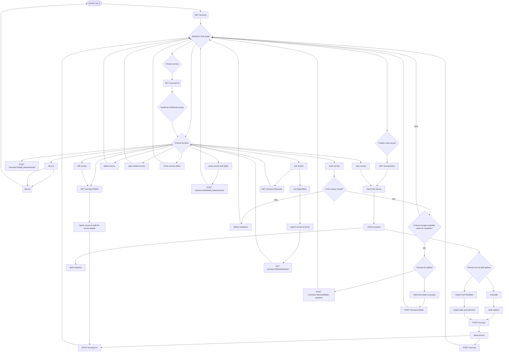
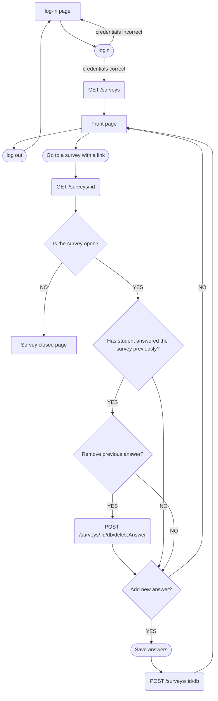

## Survery creator chart

```mermaid
flowchart TD
    %% Start/End Nodes
    A([teacher log in]) --> B
    F("log out")

    %% Teacher Main Page and Initial Actions
    B(GET /surveys) --> C{Teacher's main page}
    C --> D{Choose function}
    C --> H{Choose survey}
    C --> S{Create a new survey}
    S --> T[GET /surveys/new]
    T --> U[Name the survey]

    %% Choosing a Survey and Handling an Individual Survey
    H --> E(GET /surveys/:id)
    E --> V{handle an individual survey}
    V --> D

    %% Survey Creation Flow
    U --> W[Check answers]
    W --> X{Choose how to add options}
    X --> Y[manually]
    Y --> Z[write options]
    X --> AA[Import from template]
    AA --> BB[Import data and edit form]
    Z --> CC[POST /surveys]
    BB --> CC
    W --> DD[fetch answers]

    %% Save Survey Flow
    CC --> EE[Save survey]
    EE --> FF[POST /surveys]
    FF --> C
    EE --> GG[POST /surveys/:id]

    %% Choose Function from Main Page or Individual Survey
    D --> HI[POST /surveys/:id/add_teacher/email]
    D --> IJ[GET /surveys/:id/edit]
    D --> KL[copy survey]
    D --> MN[edit survey]
    D --> OP[close survey]
    D --> QR[sort results]
    D --> ST[delete survey]
    D --> UV[open closed survey]
    D --> WX[check survey status]
    D --> YZ[share survey edit rights]
    D --> BC[log out]

    %% Individual Function Flows

    %% Share Edit Rights
    YZ --> DE[POST /survey/:id/edit/add_teacher/email]
    DE --> C

    %% Edit Survey
    MN --> IJ
    IJ --> FG[Name survey & edit the survey details]
    FG --> GG
    GG --> C

    %% Copy Survey
    KL --> U

    %% Delete Survey
    ST --> C

    %% Check Status and Open Closed Survey
    WX --> C
    UV --> C

    %% Close Survey
    OP --> HA{Is the survey closed?}
    HA -- YES --> IB["delete answer(s)"]
    HA -- NO --> IC{Is there enough available seats for students?}
    IB --> C
    IC -- NO --> ID{Choose fix method}
    ID --> IE[POST /surveys/:id/close/delete-answers]
    IE --> C
    ID --> IF[Add extra seats to groups]
    IF --> IG[POST /surveys/:id/edit]
    IG --> C
    IC -- YES --> C

    %% Sort Results
    QR --> JH["sort [algorithm]"]
    JH --> JK[export results to Excel]
    JK --> JL(GET /surveys/:id/results/export)
    JL --> D
    QR --> KM(GET /surveys/:id/results)
    KM --> D

    %% Log out
    BC --> F

    %% Connections for 'Choose function' from other flows
    F --> A

    %% Self-loops for continuous action (simplified for flowchart readability)
    %% C --> B (Implied refresh/stay on main page)
    %% H --> E (Implied selection from a list)

    %% Cleanup/Connectors
    BC --> F
```

## Survery answerer chart

```mermaid
flowchart TD
  A[log-in page] --> B
  K([log out])

    %% Log-in Process
    B([login]) -- credentials incorrect --> A
    B -- credentials correct --> E(GET /surveys)
    E --> F["Front page"]

    %% Main View and Choose Function
    F --> K
    K --> A
    F --> G([Go to a survey with a link]) --> I(GET /surveys/:id)

    %% Survey Interaction
    I --> J{Is the survey open?}
    J -- NO --> L[Survey closed page]
    J -- YES --> M{Has student answered the survey previously?}

    M -- YES --> N{Remove previous answer?}
    N -- YES --> P(POST /surveys/:id/db/deleteAnswer)
    P --> Q{Add new answer?}
    Q -- YES --> R([Save answers])
    Q -- NO --> F

    M -- NO --> Q
    R --> S(POST /surveys/:id/db)
    S --> F

    N -- NO --> Q
```
