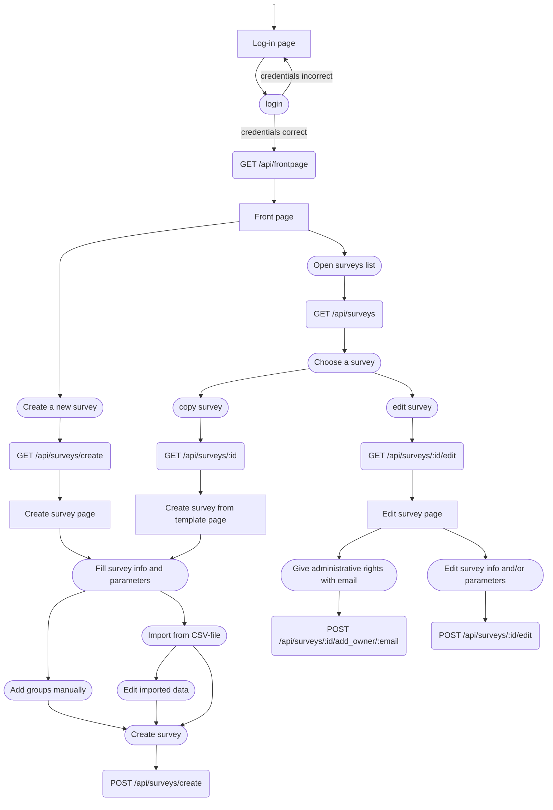
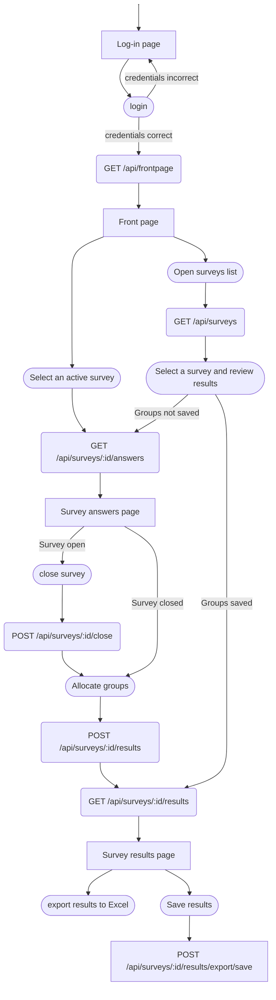
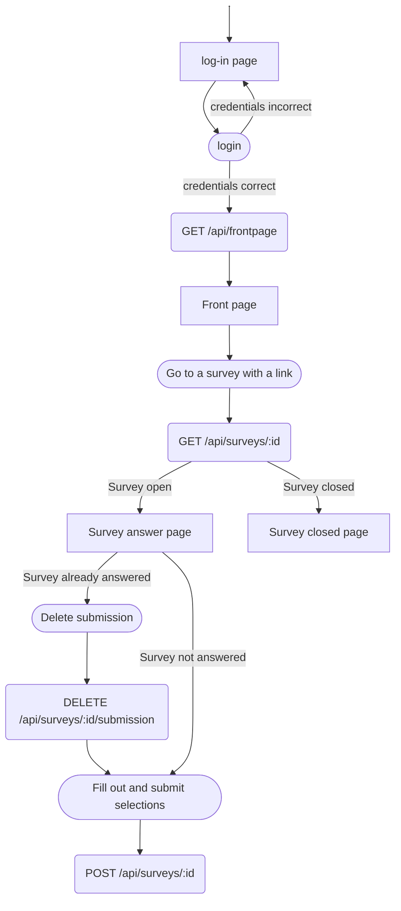

# Process flowcharts

Charts made with using [mermaidchart.com](https://www.mermaidchart.com/play)

## Create and edit survey flowchart

```mermaid
flowchart TB
    A["Log-in page"] --> n1(["login"])
    B("GET /api/frontpage") --> C["Front page"]
    C --> S(["Create a new survey"]) & n2(["Open surveys list"])
    S --> T["GET /api/surveys/create"]
    T --> n11["Create survey page"]
    AA(["Import from CSV-file"]) -- <br> --> BB(["Edit imported data"])
    AA -- </br> --> EE(["Create survey"])
    EE --> FF["POST /api/surveys/create"]
    MN(["edit survey"]) --> IJ["GET /api/surveys/:id/edit"]
    IJ --> n7["Edit survey page"]
    n1 -- credentials correct --> B
    n1 -- credentials incorrect --> A
    U(["Fill survey info and parameters"]) --> Y(["Add groups manually"]) & AA
    Y --> EE
    n2 --> n3["GET /api/surveys"]
    n3 --> n4(["Choose a survey"])
    n4 --> KL(["copy survey"]) & MN
    YZ(["Give administrative rights with email"]) --> HI["POST /api/surveys/:id/add_owner/:email"]
    n8["Untitled Node"] --> A
    BB --> EE
    n7 --> YZ & n9(["Edit survey info and/or parameters"])
    n9 --> n10@{ label: "<span style=\"padding-left:\">POST /api/surveys/:id/edit</span>" }
    n11 --> U
    KL --> n12@{ label: "<span style=\"padding-left:\">GET /api/surveys/:id</span>" }
    n12 --> n13["Create survey from template page"]
    n13 --> U

    A@{ shape: rect}
    C@{ shape: rect}
    T@{ shape: rounded}
    FF@{ shape: rounded}
    IJ@{ shape: rounded}
    n3@{ shape: rounded}
    HI@{ shape: rounded}
    n8@{ shape: anchor}
    n10@{ shape: rounded}
    n12@{ shape: rounded}
```

## Allocate groups flowchart

```mermaid
flowchart TB
    A["Log-in page"] --> n1(["login"])
    B("GET /api/frontpage") --> C["Front page"]
    C --> H(["Select an active survey"]) & n2(["Open surveys list"])
    H -- <br> --> E("GET /api/surveys/:id/answers")
    D["Survey answers page"] -- Survey open --> OP(["close survey"])
    D -- Survey closed --> n9(["Allocate groups"])
    E --> D
    n1 -- credentials correct --> B
    n1 -- credentials incorrect --> A
    n2 --> n3["GET /api/surveys"]
    n3 --> n4(["Select a survey and review results"])
    n8["Untitled Node"] --> A
    n4 -- Groups not saved --> E
    n4 -- Groups saved --> n15@{ label: "<span style=\"padding-left:\">GET /api/surveys/:id/results</span>" }
    OP --> n10["POST /api/surveys/:id/close"]
    n10 --> n9
    n9 --> n11@{ label: "<span style=\"padding-left:\">POST /api/surveys/:id/results</span>" }
    n11 --> n15
    n12["Survey results page"] --> JK(["export results to Excel"]) & n13(["Save results"])
    n13 --> n14@{ label: "<span style=\"padding-left:\">POST /api/surveys/:id/results/export/save</span>" }
    n15 --> n12

    A@{ shape: rect}
    C@{ shape: rect}
    D@{ shape: rect}
    n3@{ shape: rounded}
    n8@{ shape: anchor}
    n15@{ shape: rounded}
    n10@{ shape: rounded}
    n11@{ shape: rounded}
    n14@{ shape: rect}
```

## Answer survey flowchart

```mermaid
flowchart TB
    A["log-in page"] --> B(["login"])
    B -- credentials incorrect --> A
    B -- credentials correct --> E("GET /api/frontpage")
    E --> F["Front page"]
    F --> G(["Go to a survey with a link"])
    G --> I("GET /api/surveys/:id")
    I -- Survey open --> n2["Survey answer page"]
    I -- Survey closed --> L["Survey closed page"]
    P("DELETE /api/surveys/:id/submission") --> Q(["Fill out and submit selections"])
    n1["Rectangle"] --> A
    n2 -- Survey not answered --> Q
    n2 -- Survey already answered --> n3(["Delete submission"])
    n3 --> P
    Q --> S("POST /api/surveys/:id")

    n1@{ shape: anchor}
```
