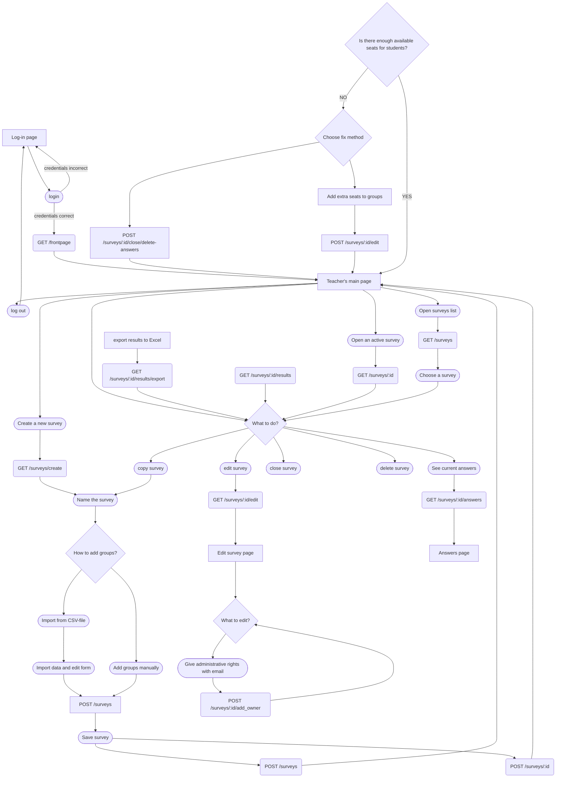
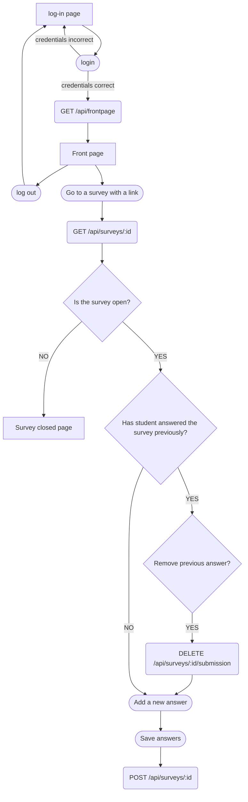

# Process flowcharts

Charts made with using [Mermaidchart.com](https://www.mermaidchart.com/play)

## Survery creator chart

```mermaid
flowchart TB
    A["Log-in page"] --> n1(["login"])
    B("GET /frontpage") --> C@{ label: "Teacher's main page" }
    C --> D{"What to do?"} & H(["Open an active survey"]) & S(["Create a new survey"]) & BC(["log out"]) & n2(["Open surveys list"])
    S --> T["GET /surveys/create"]
    T --> U(["Name the survey"])
    H --> E("GET /surveys/:id")
    X{"How to add groups?"} --> Y(["Add groups manually"]) & AA(["Import from CSV-file"])
    AA --> BB(["Import data and edit form"])
    BB --> CC["POST /surveys"]
    CC --> EE(["Save survey"])
    EE --> FF["POST /surveys"] & GG["POST /surveys/:id"]
    FF --> C
    D --> KL(["copy survey"]) & MN(["edit survey"]) & OP(["close survey"]) & ST(["delete survey"]) & WX(["See current answers"])
    MN --> IJ["GET /surveys/:id/edit"]
    IJ --> n7["Edit survey page"]
    GG --> C
    KL --> U
    IC{"Is there enough available seats for students?"} -- NO --> ID{"Choose fix method"}
    ID --> IE["POST /surveys/:id/close/delete-answers"] & IF["Add extra seats to groups"]
    IE --> C
    IF --> IG["POST /surveys/:id/edit"]
    IG --> C
    IC -- YES --> C
    JK["export results to Excel"] --> JL("GET /surveys/:id/results/export")
    JL --> D
    KM("GET /surveys/:id/results") --> D
    E --> D
    BC --> A
    n1 -- credentials correct --> B
    n1 -- credentials incorrect --> A
    U --> X
    Y --> CC
    FG["What to edit?"] --> YZ(["Give administrative rights with email"])
    n2 --> n3["GET /surveys"]
    n3 --> n4(["Choose a survey"])
    n4 --> D
    YZ --> HI["POST /surveys/:id/add_owner"]
    HI --> FG
    WX --> n5["GET /surveys/:id/answers"]
    n5 --> n6["Answers page"]
    n7 --> FG

    A@{ shape: rect}
    C@{ shape: rect}
    T@{ shape: rounded}
    FF@{ shape: rounded}
    GG@{ shape: rounded}
    IJ@{ shape: rounded}
    FG@{ shape: diam}
    n3@{ shape: rounded}
    HI@{ shape: rounded}
    n5@{ shape: rounded}
```

## Survery answerer chart

```mermaid
flowchart TB
    A["log-in page"] --> B(["login"])
    B -- credentials incorrect --> A
    B -- credentials correct --> E("GET /api/frontpage")
    E --> F["Front page"]
    F --> K(["log out"]) & G(["Go to a survey with a link"])
    K --> A
    G --> I("GET /api/surveys/:id")
    I --> J{"Is the survey open?"}
    J -- NO --> L["Survey closed page"]
    J -- YES --> M{"Has student answered the survey previously?"}
    M -- YES --> N{"Remove previous answer?"}
    N -- YES --> P("DELETE /api/surveys/:id/submission")
    P --> Q(["Add a new answer"])
    Q -- <br> --> R(["Save answers"])
    M -- NO --> Q
    R --> S("POST /api/surveys/:id")
```
