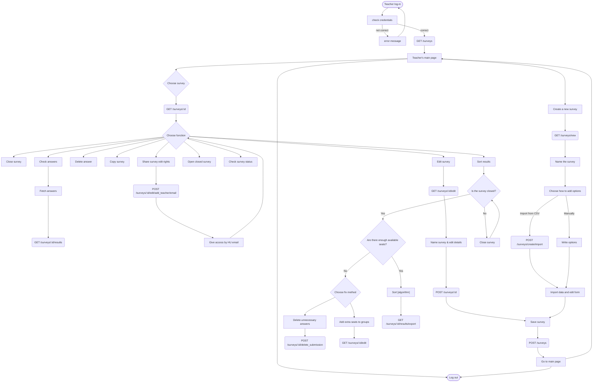
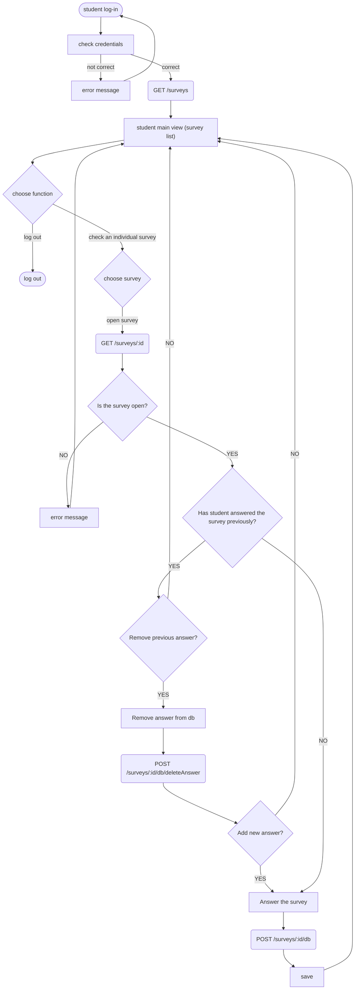

```mermaid
flowchart TD
    A([Teacher log-in]) --> B[check credentials]
    B -- not correct --> BA[error message] --> A
    B -- correct --> BB(GET /surveys)
    BB --> C[Teacher's main page]
    C --> D{Choose survey}
    D --> E(GET /surveys/:id)
    E --> F{Choose function}

    F --> G[Close survey]
    F --> H[Sort results]
    F --> I[Delete answer]
    F --> J[Copy survey]
    F --> K[Edit survey]
    F --> L[Open closed survey]
    F --> M[Check survey status]
    F --> N[Share survey edit rights]
    F --> O[Check answers]

    O --> P[Fetch answers]
    P --> Q(GET /surveys/:id/results)

    N --> R(POST /surveys/:id/edit/add_teacher/email)
    R --> RA[Give access by HU email] --> F

    K --> S(GET /surveys/:id/edit)
    S --> T[Name survey & edit details]
    T --> U(POST /surveys/:id)
    U --> V[Save survey]
    V --> W(POST /surveys)
    W --> X[Go to main page]
    X --> C

    C --> Y[Create a new survey]
    Y --> Z(GET /surveys/new)
    Z --> AA[Name the survey]
    AA --> AB[Choose how to add options]
    AB -->|Manually| AC[Write options]
    AB -->|Import from CSV| AD(POST /surveys/create/import)
    AD --> AE[Import data and edit form]
    AC --> AE
    AE --> V

    H --> AF{Is the survey closed?}
    AF -- No --> AG[Close survey]
    AG --> AF
    AF -- Yes --> AH{Are there enough available seats?}
    AH -- No --> AI{Choose fix method}
    AI --> AJ[Delete unnecessary answers]
    AJ --> AK(POST /surveys/:id/delete_submission)
    AI --> AL[Add extra seats to groups]
    AL --> AM(GET /surveys/:id/edit)
    AH -- Yes --> AN["Sort [algorithm]"]
    AN --> AO(GET /surveys/:id/results/export)

    C --> AP([Log out])
    X --> AP
```

```mermaid
flowchart TD
    %% Start/End Nodes
    A([student log-in]) --> B[check credentials]
    K([log out])

    %% Log-in Process
    B -- not correct --> D[error message] --> A
    B -- correct --> E(GET /surveys)
    E --> F["student main view (survey list)"]

    %% Main View and Choose Function
    F --> G{choose function}
    G -- log out --> K
    G -- check an individual survey --> H{choose survey}
    H -- open survey --> I(GET /surveys/:id)

    %% Survey Interaction
    I --> J{Is the survey open?}
    J -- NO --> L[error message]
    J -- YES --> M{Has student answered the survey previously?}
    L --> F
    
    M -- YES --> N{Remove previous answer?}
    N -- YES --> O[Remove answer from db]
    O --> P(POST /surveys/:id/db/deleteAnswer)
    P --> Q{Add new answer?}
    Q -- YES --> R[Answer the survey]
    Q -- NO --> F
    
    M -- NO --> R
    R --> S(POST /surveys/:id/db)
    S --> T[save]
    T --> F
    
    N -- NO --> F
```

